# NetCoreBaseStructure
This document describes the architecture of the NetCoreBaseStructure project, a foundational template for building .NET Core applications using a scalable five-layer architecture. The design ensures maintainability, testability, and separation of concerns, following best practices for modern software development.

## Five-Layer Architecture:

- **Web Layer (WebApp.Web)**: Presentation layer with ASP.NET Core MVC, areas, controllers, views, and models.
- **Business Layer (WebApp.Business)**: Business logic layer with services for core application rules.
- **Data Layer (WebApp.Data)**: Data access layer with Entity Framework Core, generic repositories, and Unit of Work for Oracle Database.
- **Common Layer (WebApp.Common)**: Shared utilities, constants, extensions, helpers, and models (e.g., DTOs).
- **Services Layer (WebApp.Services)**: Layer for external service integrations with interfaces and implementations.

### Design Patterns:
- **Generic Repository Pattern**: Abstract data access with reusable `IRepository<T>` and concrete `Repository<T>` implementations.
- **Unit of Work Pattern**: Manages transactions and coordinates multiple repositories via `IUnitOfWork`.

### Technologies:
- ASP.NET Core 8.0 (MVC)
- Entity Framework Core 8.0 with Oracle support via Oracle.EntityFrameworkCore
- Oracle Database as the data store
- DotNetEnv for managing environment variables (e.g., connection strings)

## Diagram

```mermaid
graph TD;
    
    subgraph "1️⃣ Web Layer"
        B[WebApp.Web]
    end

    subgraph "2️⃣ Business Layer"
        C[WebApp.Business]
    end

    subgraph "3️⃣ Data Layer"
        D[WebApp.Data]
    end

    subgraph "4️⃣ Common Layer"
        E[WebApp.Common]
    end

    subgraph "5️⃣ Services Layer"
        F[WebApp.Services]
    end

    subgraph "🗄️ Database"
        G[(Oracle Database)]
    end

    %% Relación entre capas
    B -->|Uses| C;
    B -->|Uses| F;
    C -->|Uses| D;
    C -->|Uses Shared Utilities| E;
    F -->|Uses| D;
    D -->|Accesses| G;

```

